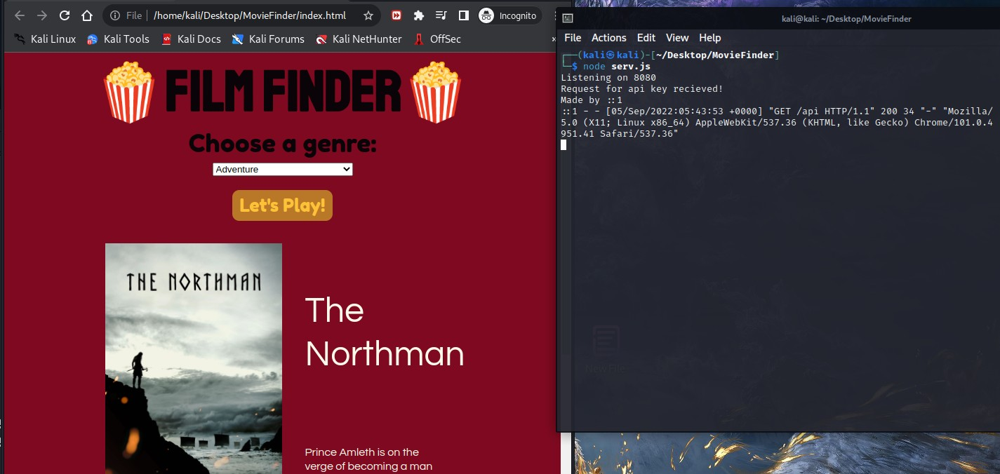

<div id="top"></div>

<!-- Header section -->
<br />
<div align="center">
  <a href="https://filmfinder.xyz">
    
  </a>
 
  <h1 align="center" style="font-weight: bold;">Film Finder</h1>

  <p align="center">
    A film generator for the indecisive movie lover 
    <br />
    <a href="https://filmfinder.xyz"><strong style="letter-spacing: 2px;">Visit filmfinder.xyz »</strong></a>
    <br />
  </p>
</div>


<!-- TABLE OF CONTENTS -->
<details>
  <summary>Table of Contents</summary>
  <ol>
    <li>
      <a href="#introduction">Introduction</a>
    </li>
    <li><a href="#built-with">Built With</a></li>
    <li>
      <a href="#getting-started">Getting Started</a>
      <ul>
        <li><a href="#prerequisites">Prerequisites</a></li>
        <li><a href="#installation">Installation</a></li>
        <li><a href="#usage">Usage</a></li>
      </ul>
    </li>
    <li><a href="#todo">TODO</a></li>
    <li><a href="#contributing">Contributing</a></li>
    <li><a href="#contact">Contact</a></li>
  </ol>
</details>

<br />


<!-- ABOUT THE PROJECT -->
# Introduction

This mini project was inspired by a task that was presented during my Javascript learning endeavors. I am an avid movie lover and highly indecisive at times so I decided to take the barebones project and improve upon it! The purpose of this web app is to grab new movies from <a href="https://www.themoviedb.org/"><strong>TheMovieDataBase</strong></a> and present them to the user in a pseudo-random fashion. 


The program is not perfect of course. For example, one point of contention that I came across was data hiding of the API key. With any kind of front-end app, you should never include API keys or API calls that use private keys in front-end code. After some testing, I learned that using environment variables does nothing to hide variables either because the browser will interpret env variables into plain text. I realized the only way to data hide properly is to use a private backend API to retrieve keys and ensure proper data obscurity. If you were to check the network debugger in any browser you could easily see the API key that I used for this app because I included external API calls into the front-end code. I was not worried about this as the API key is for a platform that I don't plan to use extensively and that is not very important to me. I merely used the Express backend server to showcase how it would be done in practice at scale. 

Another point I wanted to address. When it comes to liking and disliking functionality, the API makes use of a guest session token. I implemented the use of that on the backend to store the guest key in the server and use a singular key for everyone that uses the service. This is not ideal for obvious reasons as people may like/dislike the same movies and it would overwrite someone else's rating. However, I chose to do this over implementing a more complex system of storing guest tokens locally in browser storage for simplicity. Mostly because even if I was to store guest tokens for each individual user, the end result would largely be the same because the app uses my own personal account. I also chose to do this that way my app would only request a singular key once the old key expired rather than overwhelming the external API with numerous requests.  

Lastly, I chose to save keys in the live memory of the Express server program rather than to a database. I did this for several reasons. The data that I needed to store was mainly static and minimal at that. I felt it better to save computational time rather than connecting to and fetching from a database. But mostly I did this because I wanted to keep this app as lightweight as possible without the need to set up a database. 

<p align="right">(<a href="#top">back to top</a>)</p>


# Built With

Below are the NPM packages that I used to build this program 

* [Express.js](https://expressjs.com/)
* [Cors](https://www.npmjs.com/package/cors)
* [Helmet](https://www.npmjs.com/package/helmet)
* [Morgan](https://www.npmjs.com/package/morgan)
* [Body-parser](https://www.npmjs.com/package/body-parser)
* [Node-fetch](https://www.npmjs.com/package/node-fetch)
* Optional : [Pm2](https://www.npmjs.com/package/pm2)


<p align="right">(<a href="#top">back to top</a>)</p>


<!-- GETTING STARTED -->
# Getting Started

_This is basic laylout of what you will need to get a local copy up and running._

## Prerequisites
The following are a list of requirements and notes that user must adhere to in order for this to work!

1. The user <strong>MUST</strong> have NodeJS installed.  

2. The user <strong>MUST</strong> have all the required NPM packages installed.

3. The user <strong>MUST</strong> have the Express backend node program running.

    <strong>Optional but advised</strong>. Use a either the Pm2 NPM package or a systemd service to daemonize Express program. 

4. The user <strong>MUST</strong> have a browser with javascript enabled.


## Installation

_Below is an example of how you can use this repository._

1. Install NodeJS for your OS from [https://nodejs.org/en/](hhttps://nodejs.org/en/)

2. Clone the repository
    ```sh
    git clone https://github.com/TheExiledTheory/MovieFinder
    ```
3. Make sure NPM packages are present
    ```sh
    npm install express cors helmet morgan body-parser node-fetch 
    ```
4. Run the backend Express server `serv.js` that grabs api keys
    ```sh
    node serv.js
    ```
5. <strong>Optional:</strong> configure Pm2 as follows so that `serv.js` will run indefinately  
    ```
    pm2 start serv.js 
    pm2 status 
    pm2 logs
    ```


<p align="right">(<a href="#top">back to top</a>)</p>


<!-- USAGE EXAMPLES -->
## Usage

The use of the app is extermely straight-forward. Simply either setup a local web server for the parent folder <strong>OR</strong> drag and drop `index.html` in your browser. From their just click the "Lets Play" button. Done!

If any issues are encountered, it is most likely caused by the 'fetch' between the front end javscript and `serv.js`




<p align="right">(<a href="#top">back to top</a>)</p>


<!-- ROADMAP -->
# TODO

- [ ] Move all API calls to backend express server for proper hiding of API keys 
- [ ] Implement session management, authentication, and stricter CORS settings to prevent the backend API from being 'public' 
- [ ] Add further HTML/CSS/JS to support displaying of tv-show listings 
- [ ] Implement a login based system for users to connect an API key and save seen and liked movies/shows 
- [ ] Add HTML options to specifically customize filter searching for random movies and shows  

See the [open issues](https://github.com/TheExiledTheory/MovieFinder/issues) for a full list of proposed features (and known issues).

<p align="right">(<a href="#top">back to top</a>)</p>


<!-- CONTRIBUTING -->
# Contributing

Contributions are what make the open source community such an amazing place to learn, inspire, and create. Any contributions you make are **greatly appreciated**.

If you have a suggestion that would make this better, please fork the repo and create a pull request. You can also simply open an issue with the tag "enhancement".
Don't forget to give the project a star! Thanks again!

1. Fork the Project
2. Create your Feature Branch (`git checkout -b feature/AmazingFeature`)
3. Commit your Changes (`git commit -m 'Add some AmazingFeature'`)
4. Push to the Branch (`git push origin feature/AmazingFeature`)
5. Open a Pull Request

<p align="right">(<a href="#top">back to top</a>)</p>


<!-- CONTACT -->
# Contact

_For any comments, questions, or concerns. Feel free to message me on LinkedIn._

[![LinkedIn][linkedin-shield]][linkedin-url]


<p align="right">(<a href="#top">back to top</a>)</p>


<!-- MARKDOWN LINKS & IMAGES -->
[linkedin-shield]: https://img.shields.io/badge/-LinkedIn-black.svg?style=for-the-badge&logo=linkedin&colorB=555
[linkedin-url]: https://www.linkedin.com/in/mark-cuccarese-ii-4902b4178/
[product-screenshot]: images/screenshot.png
[website]: https://filmfinder.xyz/


